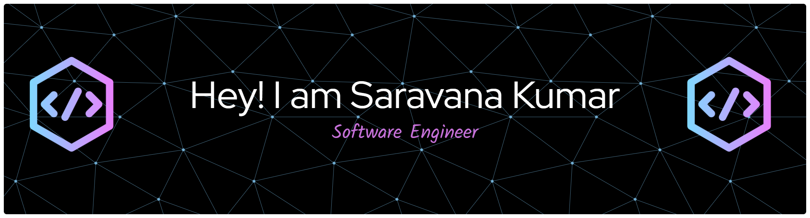

# 💫 About Me:
Hi there! 👋 I’m Saravana, a Computer Science graduate student at Stony Brook University. I’m passionate about building software that blends performance and creativity — from backend systems to full-stack applications.

## 🌐 Socials:
  

---

# 💻 Tech Stack:

### 🗣️ Languages
            

### 🛠️ Frameworks & Libraries
             

### 🗄️ Databases
      

### ☁️ Cloud & DevOps
        

### 📊 Data Science & ML
   

---

# 📊 GitHub Stats:

  

  

---

